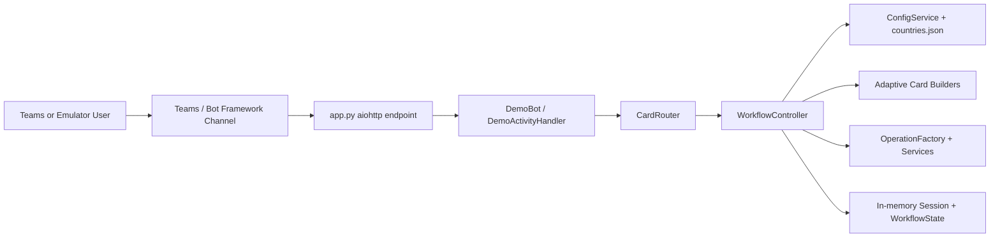

# 01 - Application Overview

## Business Problem

Vendor onboarding often varies by country: each country can require different tax, bank, and registration documents. This bot explores a maintainable approach where the conversation and processing steps come from configuration instead of country-specific `if/else` code.

## Project Scope

Implemented scope is a Phase 1 demo bot that runs inside Bot Framework-compatible channels and can be exercised locally. It is not a production integration with real OCR, bank, tax, vendor-master, malware scanning, or persistent storage services.

## Implemented

- Supported countries loaded from `config_data/countries.json`: France, Germany, USA, and India.
- Supported top-level operations shown to users: `Create`, `Request Check`, and `Existence Check`.
- Most complete implemented journey: France + `Create` using top-level `document`, `form`, `review`, and `operation` workflow steps.
- Document metadata and upload validation for France AVIS and RIB, including allowed file extensions.
- Mock operation services: `OCR`, `VALIDATION`, `SIRET`, `TIN`, `BANK`, `GST`, `DUPLICATE_CHECK`, and `CREATE_VENDOR`.
- Dynamic Adaptive Cards for country, operation, upload, progress, details form, and review.

## Current Limitations

- Germany, USA, and India use legacy top-level `upload`/`operation` workflows. The live `WorkflowService.start_current_workflow_step()` handles `document`, `form`, `review`, and `operation` as active conversation steps, so those legacy `upload` paths are not equivalent to the France document-stage flow.
- `Request Check` and `Existence Check` do not run distinct workflows; non-document operations currently route to vendor creation behavior.
- Services are mock implementations that mutate `ProcessingContext` with `status: completed` values.
- State is stored in an in-memory dictionary on `WorkflowController`.

## User Roles and Use Cases

| Role | Use case |
| --- | --- |
| Teams user / requester | Start onboarding, select country/operation, provide documents and contact data, review, confirm. |
| Developer | Add countries, document types, operations, validation, or production integrations. |
| Reviewer / architect | Assess configuration-driven workflow, state transitions, card behavior, and Phase 2 readiness. |

## Context Diagram

## Future Direction

Planned enhancements should replace mock services with external integrations, move state to durable storage, add authenticated file retrieval and scanning, improve idempotency and retries, and split long-running work into background processing.
