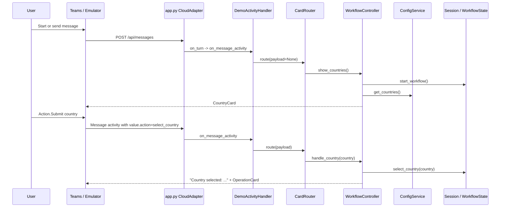

# 02 - Application Flow

## End-to-End Journey

1. `app.py` configures logging, creates a Bot Framework `CloudAdapter`, installs `on_error`, creates one `DemoBot`, and exposes `POST /api/messages`.
2. `DemoBot` composes `ConfigService`, `WorkflowController`, and `CardRouter`.
3. A message or card submit reaches `DemoActivityHandler.on_message_activity()`.
4. The handler extracts `turn_context.activity.value` as the Adaptive Card payload and passes it to `CardRouter.route()`.
5. No payload, plain text, or unknown action shows the country card.
6. `select_country` stores the country and sends an acknowledgement message plus the operation card.
7. `select_operation` stores the operation. `Create` starts document collection; other configured labels currently route to vendor creation.
8. France `Create` starts at `process_avis`, sends an AVIS upload card, and pauses.
9. The user submits a local file path or uploads an attachment. The bot validates it with document metadata.
10. The controller sends a progress card, stores its activity ID on the document state, runs nested operations sequentially, and updates the same card after each status change.
11. When AVIS completes, `complete_document()` advances to RIB and sends the RIB upload card.
12. After RIB processing completes, the details form is shown.
13. `submit_vendor_information` validates configured fields server-side, stores form data, and advances to review.
14. `edit_vendor_information` returns to the form without resetting completed document states.
15. `confirm_vendor` advances to `vendor_creation`, calls `CREATE_VENDOR` through `OperationFactory`, marks the workflow complete, and sends a success text.

## Pause-and-Resume Points

The bot cannot complete the entire workflow in one request because each user interaction arrives as a later activity. The state fields `phase`, `waiting_for`, `current_workflow_index`, `current_document`, document statuses, form data, and review/vendor flags tell the next turn what to do.

Pause points:

- Country selection card waits for `select_country`.
- Operation card waits for `select_operation`.
- Upload card waits for `submit_documents`, plain text file path, or attachment.
- Vendor information card waits for `submit_vendor_information`.
- Review card waits for `confirm_vendor` or `edit_vendor_information`.

## Activity Lifecycle

- HTTP JSON activity arrives at `/api/messages`.
- `CloudAdapter.process_activity()` authenticates/translates and calls `BOT.on_turn`.
- `ActivityHandler` invokes `on_message_activity()` for message activities.
- Adaptive Card `Action.Submit` values are read from `turn_context.activity.value`.
- Attachments are read from `turn_context.activity.attachments`.
- Replies are sent through `send_activity()`; progress cards are mutated through `update_activity()`.

## Country Selection Sequence



## Document Processing Sequence

```mermaid
sequenceDiagram
    participant U as User
    participant R as CardRouter
    participant W as WorkflowController
    participant S as WorkflowService / WorkflowState
    participant F as OperationFactory
    participant O as BaseOperation service
    participant P as ProgressCard

    U->>R: value.action=submit_documents or attachment/text
    R->>W: handle_submit()
    W->>S: submit_document(document_value)
    W-->>U: send progress card
    W->>S: store document.progress_activity_id
    loop each nested configured step
        W->>P: render running status
        W-->>U: update_activity(activity_id)
        W->>F: get(operation name)
        F-->>W: operation service
        W->>O: execute(ProcessingContext)
        O-->>W: updated context
        W->>S: store result and mark step COMPLETED
        W-->>U: update_activity(activity_id)
    end
    W->>S: complete_document(); advance workflow index
    W-->>U: next upload card or form/review
```

## Form and Review Sequence

```mermaid
sequenceDiagram
    participant U as User
    participant W as WorkflowController
    participant S as WorkflowService
    participant C as DetailsFormCard / ReviewCard
    participant F as OperationFactory

    W-->>U: DetailsFormCard
    U->>W: value.action=submit_vendor_information
    W->>S: submit_form(payload)
    alt validation errors
        W->>C: render form with errors and existing values
        W-->>U: form card again
    else valid
        S->>S: store form_data and start review step
        W-->>U: ReviewCard
    end
    U->>W: confirm_vendor or edit_vendor_information
    alt edit
        W->>S: edit_form()
        W-->>U: DetailsFormCard with existing values
    else confirm
        W->>S: confirm_review(); mark_vendor_created()
        W->>F: get(CREATE_VENDOR)
        W-->>U: Vendor created successfully.
    end
```
