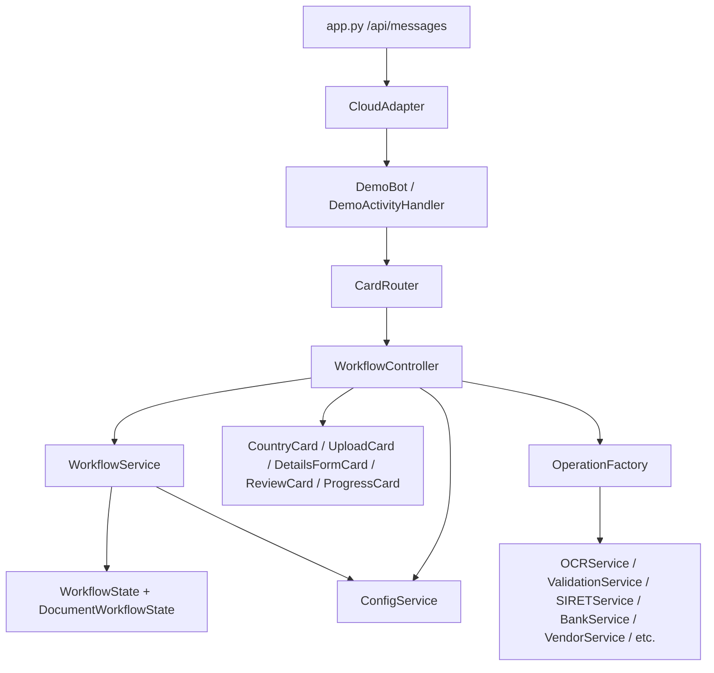

# 03 - Architecture

## Layers

| Layer | Responsibility | Key code | Must not do |
| --- | --- | --- | --- |
| HTTP/Bot Adapter | Receive Bot Framework HTTP activities and handle adapter errors. | `app.py` | Contain workflow rules. |
| Bot Interface | Convert Bot Framework callbacks into router calls. | `bot/main_bot.py`, `bot/demo_bot.py` | Parse business workflow. |
| Routing | Dispatch Adaptive Card actions by payload `action`. | `flows/router.py` | Make state transitions itself. |
| Workflow Orchestration | Coordinate sessions, cards, uploads, operations, review, completion. | `flows/vendor_create/create_flow.py` | Embed card JSON or external API details. |
| Workflow State | Enforce conversation phases and cursor transitions. | `flows/vendor_create/document_collector.py`, `models/workflow.py` | Render UI or call Bot Framework. |
| Configuration | Load and validate JSON into typed models. | `config_data/country_config.py`, `models/country.py` | Perform runtime conversation logic. |
| Card Presentation | Build Adaptive Card attachments. | `cards/*.py`, `utils/adaptive_card_loader.py` | Mutate workflow state or call services. |
| Operation Domain | Execute one processing operation through a common interface. | `core/base_operations.py`, `services/*.py`, `core/operation_factory.py` | Send cards directly. |
| Progress | Represent and render live processing status. | `services/progress_service.py`, `models/progress.py`, `cards/progress_card.py` | Decide country workflow order. |

## Component Diagram

## Dependency Direction

The outer Bot Framework layer depends inward on routing and orchestration. Orchestration depends on state, configuration, cards, and operations. Operation services depend on `BaseOperation` and the shared `ProcessingContext`, not on Bot Framework. This keeps UI-specific code separate from business-operation code.

## Architectural Weaknesses Found

- `WorkflowController` stores sessions in a process-local dictionary; restart or horizontal scaling loses state.
- The controller contains a custom document-processing loop while `core.DocumentProcessor` also exists; future work should consolidate these orchestration paths.
- Legacy workflow step type `upload` exists in non-France country configuration, but the active `WorkflowService` conversation path is optimized for top-level `document` steps.
- Vendor creation currently sends a text confirmation rather than a dedicated completion Adaptive Card.

## Why This Architecture Was Selected

The design supports extensibility and testability: country behavior lives in JSON, state transitions can be unit tested without Bot Framework, operations share an interface, and cards are built centrally. This reduces hardcoding and allows Phase 2 production integrations to replace mock services without rewriting the conversation layer.
