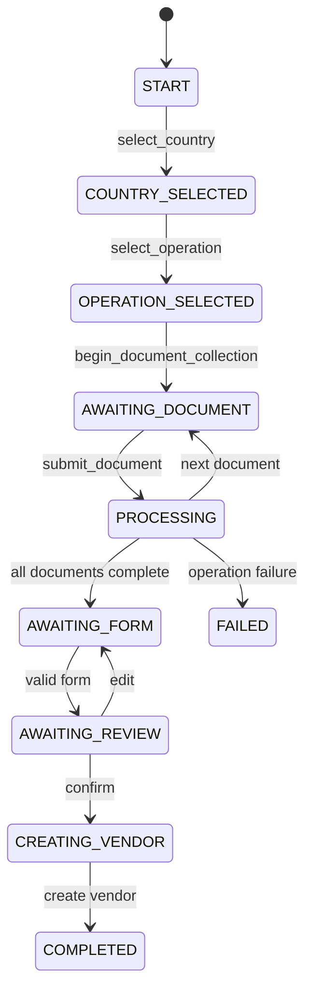

# 06 - Workflow Engine

## Source of Truth

`config_data/countries.json` is the source of truth for country metadata, document requirements, operation registry labels, and workflow order. `ConfigService` reads the JSON once and validates structure into `Country`, `DocumentConfig`, `WorkflowStep`, and `WorkflowConfig` dataclasses.

## Country Configuration Schema

Each country has:

- `countryCode`: country code used for display/integration context.
- `currency`: configured currency.
- `documents`: upload metadata.
- `workflow`: ordered conversation and processing stages.

### Documents vs Workflow

`documents` answers: "What files are valid for this country?" It contains document type, display name, required flag, min/max file counts, allow-multiple behavior, extensions, and sometimes legacy operation metadata.

`workflow` answers: "What happens, in what order?" It contains stages such as `document`, `form`, `review`, `operation`, plus legacy `upload` and nested `operation`/`decision` steps.

## Step Types in the Active Flow

| Step type | Required properties | Runtime behavior | Pause behavior | Completion |
| --- | --- | --- | --- | --- |
| `document` | `id`, `title`, `document`, nested `steps` | Set current document, request upload, process nested steps after submit. | Pauses with `WorkflowPhase.AWAITING_DOCUMENT`. | `complete_document()` advances cursor. |
| Nested `operation` | `id`, `title`, `operation` | Resolved via `OperationFactory` and executed. | No pause during execution. | Step state becomes `COMPLETED` or `FAILED`. |
| Nested `decision` | `id`, `title`, `operation`, outcomes in config | Executes operation and records result. Active controller does not branch to duplicate card yet. | No pause currently. | Completed unless operation fails. |
| `form` | `id`, `title`, `fields`, `submit.action` | Render dynamic fields and validate payload. | Pauses with `AWAITING_FORM`. | Valid submit advances to review. |
| `review` | `id`, `title`, `actions` | Render current state and submit confirm/edit. | Pauses with `AWAITING_REVIEW`. | Confirm advances; edit returns to form. |
| `operation` | `id`, `title`, `operation` | Used for final vendor creation. | No pause after confirmation. | Workflow becomes `COMPLETED`. |
| `upload` | `id`, `title`, `document` | Accepted by config validator for legacy country flows. | Current limitation: not the active document-stage path. | Should be migrated or handled explicitly. |

## France Example

```json
{
  "id": "process_avis",
  "title": "Process AVIS Document",
  "type": "document",
  "document": "AVIS",
  "steps": [
    {"id": "ocr_avis", "title": "Extract Information from AVIS", "type": "operation", "operation": "OCR"},
    {"id": "validate_avis", "title": "Validate Extracted Information", "type": "operation", "operation": "VALIDATION"},
    {"id": "siret_validation", "title": "Validate SIRET", "type": "operation", "operation": "SIRET"},
    {"id": "duplicate_check", "title": "Check Duplicate Vendor", "type": "decision", "operation": "DUPLICATE_CHECK", "onSuccess": "CONTINUE", "onDuplicate": "SHOW_DUPLICATE_CARD"}
  ]
}
```

## Sequential Document Behavior

France intentionally processes AVIS before asking for RIB:

```text
Request AVIS -> Process AVIS -> Request RIB -> Process RIB -> Form -> Review -> Create Vendor
```

This keeps the user focused on one upload at a time, allows progress to be shown for the current document, and prevents later steps from running if an earlier required document fails.

## Cursor Advancement and Duplicate Protection

`WorkflowState.current_workflow_index` points at the active top-level step. `complete_document()`, valid `submit_form()`, and `confirm_review()` increment it. Completed document steps are skipped by `start_current_workflow_step()`, and nested document step IDs marked `COMPLETED` are not rerun in `_process_current_document()`.


