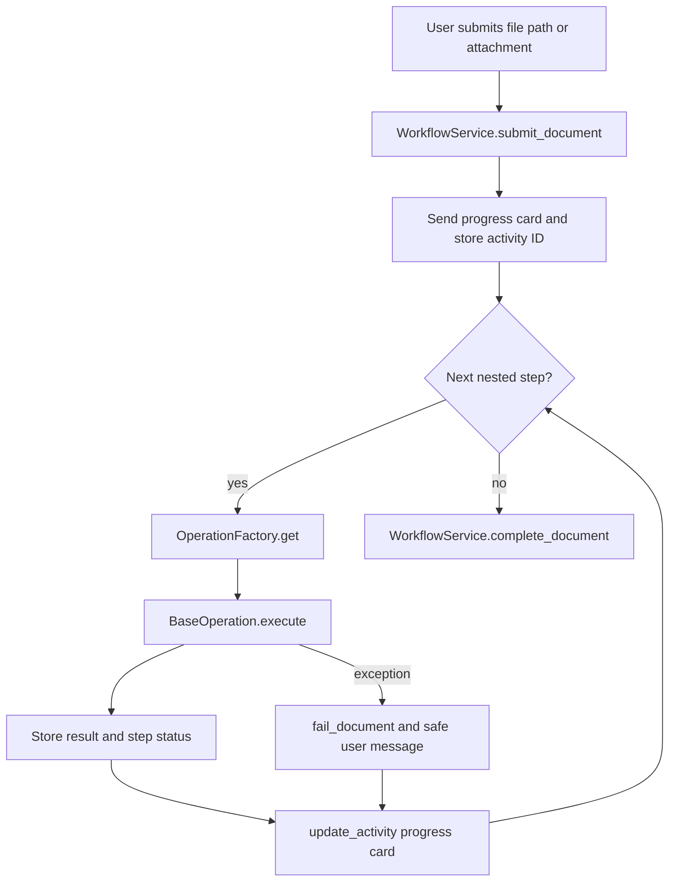

# 08 - Document Processing

## Lifecycle

```text
PENDING -> WAITING_FOR_UPLOAD -> UPLOADED -> PROCESSING -> COMPLETED
                                      \-> FAILED
```

The active document stage is selected by `WorkflowState.current_document`. France starts with AVIS and then moves to RIB.

## Runtime Flow

1. `WorkflowService.start_current_workflow_step()` marks the document as `WAITING_FOR_UPLOAD`.
2. `UploadCard` requests the current document.
3. `WorkflowController._extract_document_value()` reads `document_path`, `document`, plain text, or first attachment name/content URL.
4. `WorkflowService.submit_document()` validates active phase, extension, file count, and multiple-upload rules.
5. `_process_current_document()` marks the document `PROCESSING`, creates `ProgressService`, sends or updates a progress card, and builds a `ProcessingContext`.
6. For each nested configured step, the controller resolves the operation from `OperationFactory`, executes it, stores a non-sensitive result snapshot, marks progress complete, and updates the same card.
7. On success, `WorkflowService.complete_document()` marks the document complete and advances the workflow cursor.
8. On exception, the document and workflow are marked failed and the user receives a safe error message.

## Implemented and Mocked Operations

| Operation | Service | Mock behavior |
| --- | --- | --- |
| `OCR` | `OCRService` | Adds `{"status": "completed"}` under `context.ocr_result`. |
| `VALIDATION` | `ValidationService` | Adds completed validation status. |
| `SIRET` | `SIRETService` | Adds completed tax status. |
| `TIN` | `TINService` | Adds completed tax status. |
| `BANK` | `BankService` | Adds completed bank status. |
| `GST` | `GSTService` | Adds completed tax status. |
| `DUPLICATE_CHECK` | `DuplicateCheckService` | Sets `duplicate_found` to `False`. |
| `CREATE_VENDOR` | `VendorService` | Sets `creation_status` to `created`. |

## Processing Diagram



## Separation of Concerns

Operation services should not build cards or call `TurnContext`; they only update `ProcessingContext`. The controller handles orchestration and Bot Framework I/O. This keeps external service logic testable and reusable outside Teams.
