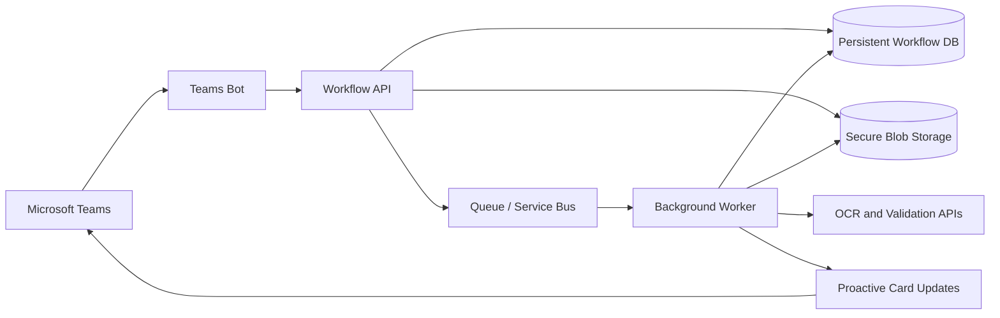

# 14 - Production Readiness

## Already Implemented

- Bot Framework HTTP endpoint and adapter error hook.
- Structured-ish logging with activity context.
- Configuration loading and structural validation.
- Server-side form and document validation basics.
- In-place progress card updates.
- Basic idempotency guards for form review and vendor creation.
- Unit tests for workflow state and logging.

## Partially Implemented

- Error handling: safe messages exist, but card update failures and stale cards need specific handling.
- Idempotency: local flags exist, but no durable idempotency keys or distributed locks.
- Configuration-driven workflows: France path is coherent; other countries need migration to the active document-stage model or expanded dispatcher support.
- Operation abstraction: service interface exists, but real API clients, timeouts, and retries are absent.
- Logging: useful context exists, but PII redaction and metrics/tracing are not implemented.

## Required Before Production

- Persistent state storage with concurrency control.
- Authentication and authorization checks for who can create vendors.
- Secrets management through managed identity, Key Vault, or environment-backed secret providers.
- Secure file download from Teams, file type verification, malware scanning, and safe temporary storage.
- PII redaction for logs and review displays.
- Real OCR, tax, bank, duplicate, and vendor-master integrations.
- Retry policies, timeouts, circuit breakers, and rate limiting.
- Background processing for long-running document operations.
- Monitoring, metrics, distributed tracing, and alerting.
- Handling for deleted/expired cards and `update_activity()` failures.
- CI/CD, deployment manifests, integration tests, disaster recovery, and rollback plans.

## Proposed Phase 2 Architecture

## Incremental Plan

1. Migrate state from in-memory sessions to durable storage.
2. Add idempotency keys for submit, upload, and vendor creation actions.
3. Replace mock operations one at a time behind `BaseOperation`.
4. Move document processing to a queue-backed worker once real OCR/validation latency is introduced.
5. Add observability and security controls before exposing to production users.
